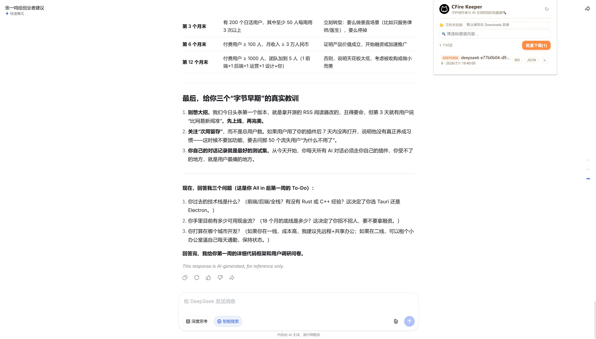
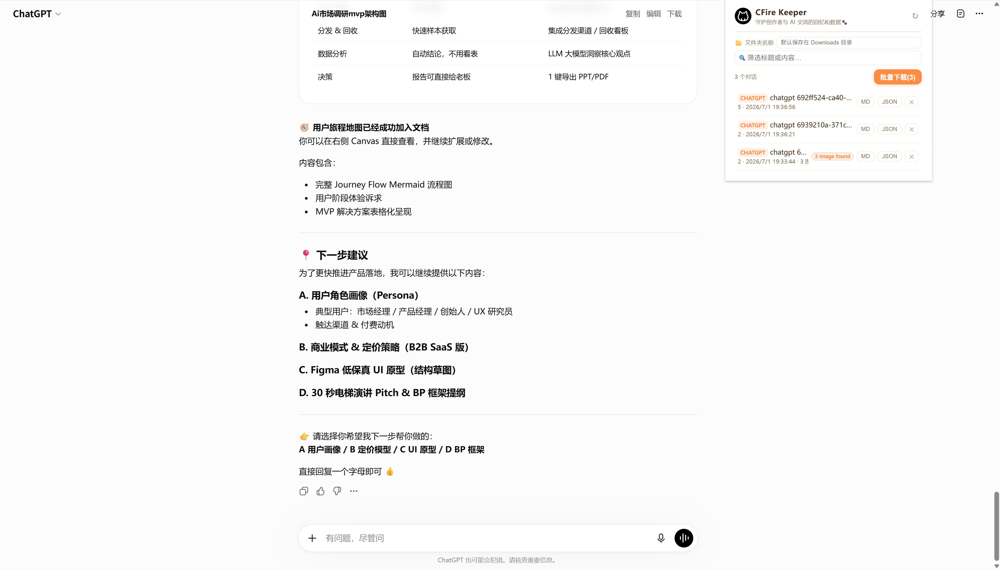
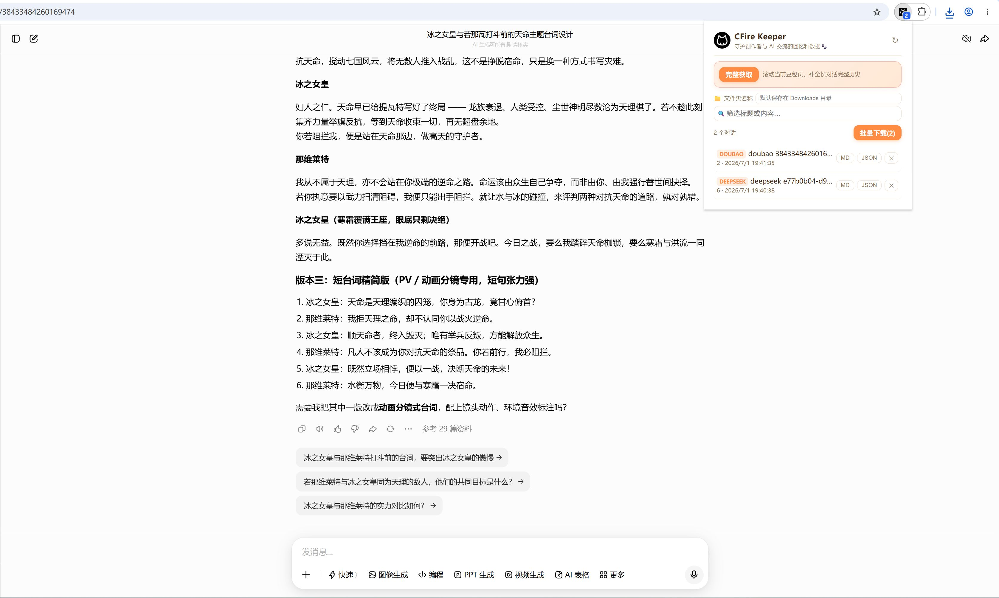
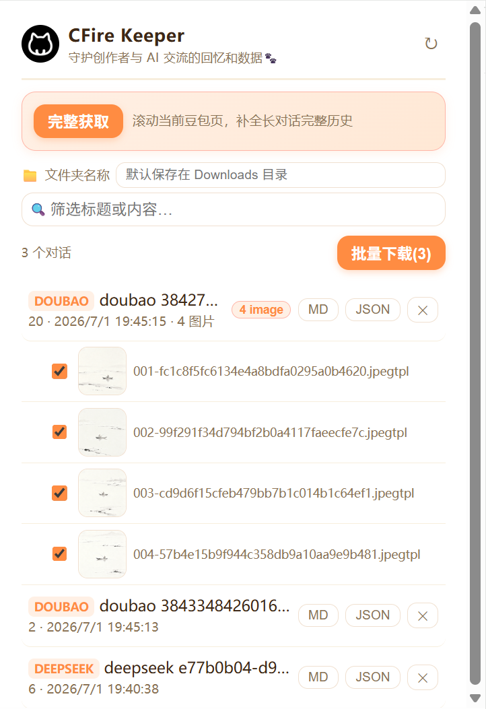

# CFire Chat Keeper

**Preserve the memories and data of creators' conversations with AI 🐾**

<div align="center">

English | [中文](./README.md)


</div>


---

## 📖 Introduction

CFire Chat Keeper is a Chrome extension that helps you batch extract and save conversation records with AI assistants such as DeepSeek, ChatGPT, and Doubao. Whether it's a creative dialogue sparked by inspiration or a carefully tuned prompt engineering session, you can save it locally with one click and preserve it forever.

## ✨ Core Features

### 🌐 Multi-Platform Support

Supports conversation extraction from mainstream AI dialogue platforms:

| Platform | Status | Demo |
|------|---------|------|
| DeepSeek | ✅ Fully Supported |  |
| ChatGPT | ✅ Fully Supported |  |
| Doubao | ✅ Fully Supported |  |

### 📥 Batch Export

- **Markdown Format**: Ideal for reading and secondary editing
- **JSON Format**: Suitable for programmatic processing and data backup
- **Batch Download**: Export all conversations with one click, with custom save paths

### 🖼️ Image Extraction

Automatically identifies image content in conversations and supports selective downloading:



- Expand conversations to view all images
- Check the images you want to save
- Images are saved in the `images` subdirectory under the conversation folder

### 🔍 Smart Filtering

- Real-time search through conversation titles and content
- Quickly locate historical conversations
- Supports keyword filtering

### 📁 Flexible Storage

- Custom save path (relative to the Downloads directory)
- History feature for quickly switching between commonly used directories
- Automatic folder structure creation

### 🔄 Full History Retrieval

For long conversations on platforms like Doubao, a "Scroll to Retrieve" feature is provided:

- Automatically scrolls the page to load the complete history
- Ensures no conversation content is missed
- Real-time progress display

## 🚀 Installation

### Installation Demo

<video src="./demo/install.mp4" controls width="100%"></video>

### Method 1: Install from Release (Recommended)

1. Download the latest version `CFire-Chat-Keeper-v0.2.0-chrome.zip` from [Releases](https://github.com/CFire-Studio/cfire-chat-keeper/releases)
2. Extract it to any directory
3. Open Chrome and visit `chrome://extensions/`
4. Enable "Developer mode" in the top right corner
5. Click "Load unpacked"
6. Select the extracted folder

### Method 2: Build from Source

```bash
# Clone the repository
git clone <repository-url>
cd ai-chat-keeper

# Install dependencies
npm install

# Development mode
npm run dev

# Production build
npm run build
```

After the build is complete, load the extension from the `build/chrome-mv3-prod` directory.

## 📖 User Guide

### Basic Usage

1. **Install the extension**: Follow the methods above to install CFire Chat Keeper
2. **Open the conversation page**: Visit the conversation page of DeepSeek, ChatGPT, or Doubao
3. **Automatic collection**: The extension will automatically capture conversation content
4. **View conversations**: Click the extension icon to view all collected conversations
5. **Export conversations**: Click the MD or JSON button to export a single conversation

### Batch Export

<video src="./demo/download-demo.mp4" controls width="100%"></video>

1. Click the "Batch Download" button in the extension popup
2. Select the export format (Markdown or JSON)
3. Wait for the download to complete, with real-time progress bar display

### Custom Save Path

1. Enter the path in the "Folder Name" input box (e.g., `ai-chats/2026`)
2. The path is relative to the Downloads directory
3. Commonly used paths are automatically recorded and can be quickly switched via shortcut buttons

### Handling Long Doubao Conversations

For long conversations on the Doubao platform:

1. Open the Doubao conversation page
2. Click the "Full Retrieve" button in the extension
3. The extension will automatically scroll the page to load the complete history
4. Refresh the conversation list after scrolling is complete

## 🎨 Interface Preview

### Main Interface

- **Brand Identity**: CFire Chat Keeper Logo and slogan
- **Refresh Button**: Manually refresh the conversation list
- **Save Path**: Customize the export directory
- **Search Box**: Real-time conversation filtering
- **Conversation List**: Display all collected conversations
- **Batch Download**: Export all conversations with one click

### Conversation Item

Each conversation item displays:

- 🏷️ Platform identifier (DeepSeek / ChatGPT / Doubao)
- 📝 Conversation title
- 📊 Message count
- 🕒 Update time
- 🖼️ Image count (if any)
- 📥 Export buttons (MD / JSON)
- 🗑️ Delete button

## 🔧 Tech Stack

- **Framework**: Plasmo (Chrome Extension Framework)
- **Language**: TypeScript
- **UI**: React 18
- **Build Tool**: Plasmo Build System
- **Manifest**: Chrome Extension Manifest V3

## 📂 Project Structure

```
ai-chat-keeper/
├── src/
│   ├── popup.tsx           # Popup main interface
│   ├── background.ts       # Background service
│   ├── contents/           # Content scripts
│   │   ├── collector.ts    # Conversation collector
│   │   └── main-world-hook.ts
│   └── lib/
│       ├── types.ts        # Type definitions
│       ├── parsers.ts      # Platform parsers
│       ├── export.ts       # Export logic
│       ├── batch.ts        # Batch download
│       ├── images.ts       # Image processing
│       ├── i18n.ts         # Internationalization
│       ├── site-config.ts  # Site configuration
│       └── ...
├── build/
│   ├── chrome-mv3-dev/     # Development build
│   └── chrome-mv3-prod/    # Production build
├── release/                # Release packages
└── demo/                   # Demo images
```

## 🌍 Internationalization Support

Automatically detects browser language:

- Chinese (Simplified/Traditional): Displays Chinese interface
- Other languages: Displays English interface

## 🐛 Feedback

If you encounter issues or have feature suggestions:

1. **Refresh the extension**: Click the ↻ button in the top right corner
2. **Refresh the page**: Reload the conversation page
3. **Email feedback**: dev@tokenspark.uno

## 📝 Changelog

### v0.2.0

- ✅ Support for DeepSeek, ChatGPT, and Doubao
- ✅ Batch export feature
- ✅ Image recognition and selective download
- ✅ Custom save path
- ✅ Real-time search and filtering
- ✅ Full retrieval for long Doubao conversations
- ✅ Chinese and English bilingual support

## 📄 License

This project is for learning and personal use only.

## 🙏 Acknowledgments

Thanks to all AI platforms for their excellent services, enabling creators to have wonderful conversations with AI.

---

<div align="center">

**CFire Chat Keeper - Preserving Every AI Conversation with You** 🐾

</div>
